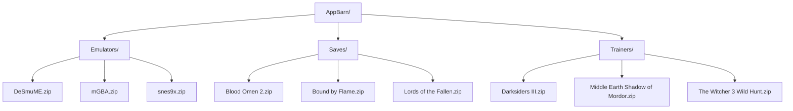

**AppBarn: Archive for Files, Softwares and Tools**

**Instructions**
1. Create category folders e.g. Emulators
2. Add files to based on categories (Files must be compressed)
3. Click on category to display files
4. Use search box to filter results 

 

