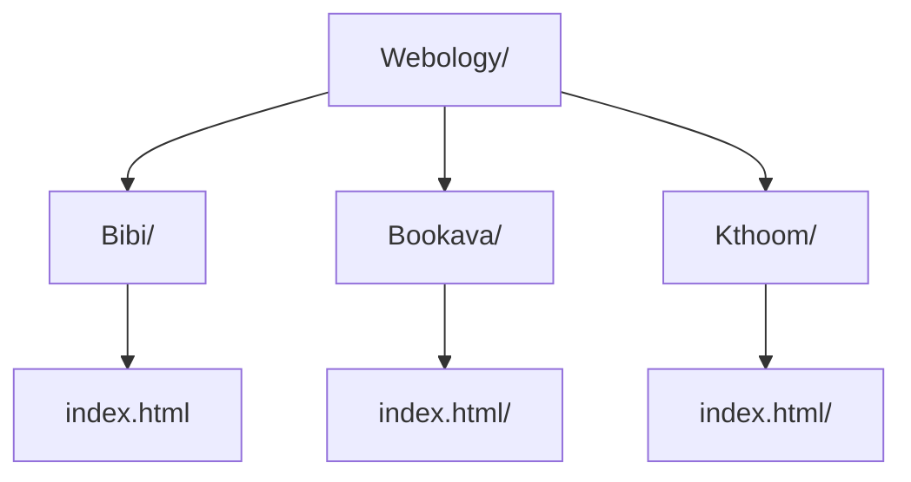

**Webology: HTML Game Player**

**Instructions**
1. Add HTML Games in Webology Folder 
4. Select HTML Game

```mermaid
graph TD
    Webology["Webology/"] --> folder1["Bibi/"]
    Webology --> folder2["Bookava/"]
    Webology --> folder3["Kthoom/"]

    folder1 --> sub1["index.html"]

    folder2 --> sub2["index.html/"]

    folder3 --> sub3["index.html/"]


 

 


```