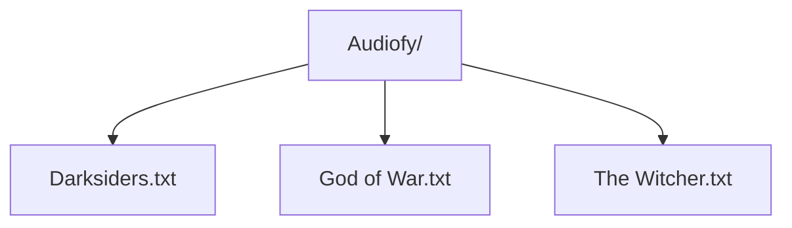

**Audiofy: Text to Speech Player**

**Instructions**
1. Type text into text box
2. Use Load feature to retrieve text from folders
3. Use speak feature to start narration
4. Use stop to stop narration 

 

