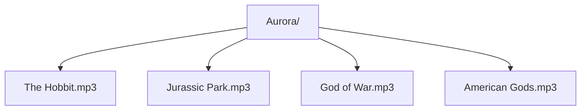

**Aurora: The Audiobook, Podcast and Radio plays Player**

**Instructions**
1. Add audio files in Aurora Folder
2. Use Load feature to retrieve audio files
3. Use Scan feature to display audio from Aurora folder
4. Use Previous and Next Buttons to rewind and forward by 10 seconds
5. Select audiobooks via the playlist 

 

