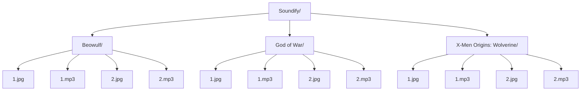

**Soundify: Sound and Wallaper Player**

**Instructions**
1. Create category folders e.g. Beowulf
2. Add audio and wallapers to each category 
3. Ensure that the audio and wallpaper have the same number 

