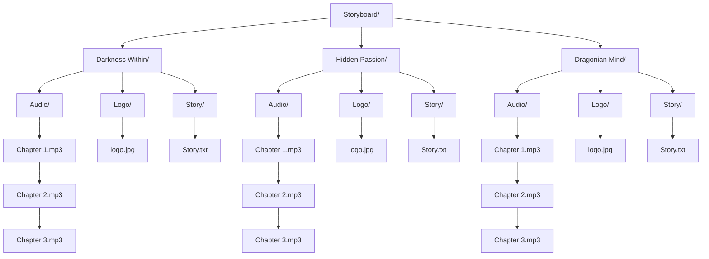

**Storyboard: The Story Player**

**Instructions**
1. Create category folders e.g. Darkness Within
2. Create Audio, Logo and Story folders
3. Add audio, logo and text in there respective folders
4. Click Load to see created folders and select one 
5. Click on any audio to start the narration (Click again to pause)
6. Click on story to read it 

    

