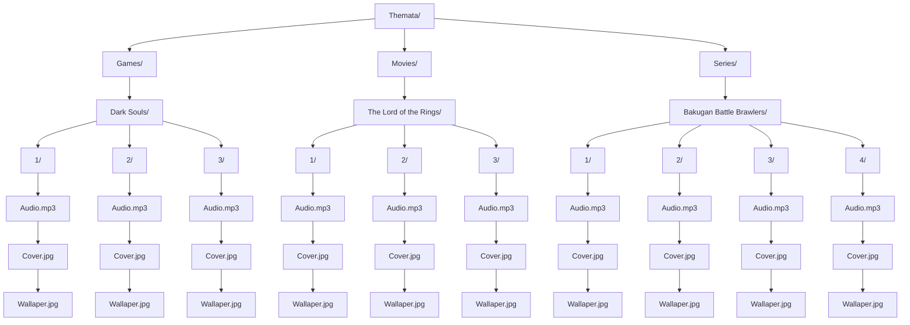

**Themata: The Theme Player**

**Instructions**
1. Create category folders e.g. Games
2. Add subfolders based on category e.g. Dark Souls 
3. Add additional subfolders e.g. 1,2,3
4. Add audio, cover and wallaper in additional subfolders  

