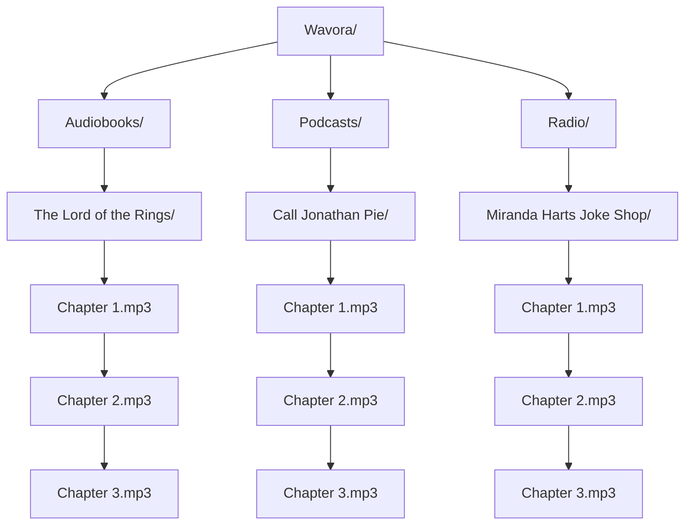

**Wavora: The Audio Collection**

**Features**
1. Create category folders e,g, Audiobooks
2. Add subfolders based on the category e.g. The Lord of the Rings

```mermaid
graph TD
    Wavora["Wavora/"] --> folder1["Audiobooks/"]
    Wavora --> folder2["Podcasts/"]
    Wavora --> folder3["Radio/"]

    folder1 --> sub1["The Lord of the Rings/"]

    sub1 --> audio1["Chapter 1.mp3"]
    audio1 --> audio2["Chapter 2.mp3"]
    audio2 --> audio3["Chapter 3.mp3"]

    folder2 --> sub2["Call Jonathan Pie/"]

    sub2 --> audio4["Chapter 1.mp3"]
    audio4 --> audio5["Chapter 2.mp3"]
    audio5 --> audio6["Chapter 3.mp3"]

    folder3 --> sub3["Miranda Harts Joke Shop/"]

    sub3 --> audio7["Chapter 1.mp3"]
    audio7 --> audio8["Chapter 2.mp3"]
    audio8 --> audio9["Chapter 3.mp3"]


```