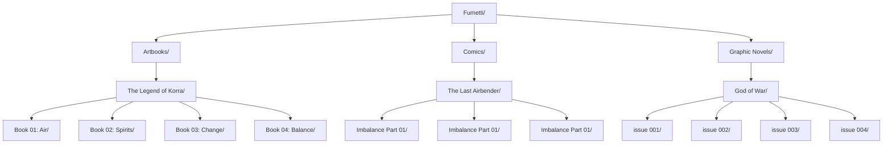

**Fumetti: Image comic book, graphic novel and artbook Collection**

**Instructions**
1. Create category folders e.g. Artbooks
2. Add subfolders based on categopry e.g. The Legend of Korra

```mermaid
graph TD
    Fumetti["Fumetti/"] --> folder1["Artbooks/"]
    Fumetti --> folder2["Comics/"]
    Fumetti --> folder3["Graphic Novels/"]

    folder1 --> sub1["The Legend of Korra/"]

    sub1 --> LOK1[" Book 01: Air/"]
    sub1 --> LOK2[" Book 02: Spirits/"]
    sub1 --> LOK3[" Book 03: Change/"]
    sub1 --> LOK4[" Book 04: Balance/"]

    folder2 --> sub2["The Last Airbender/"]

    sub2 --> ATLA1["Imbalance Part 01/"]
    sub2 --> ATLA2["Imbalance Part 01/"]
    sub2 --> ATLA3["Imbalance Part 01/"]

    folder3 --> sub3["God of War/"]

    sub3 --> GOW1["issue 001/"]
    sub3 --> GOW2["issue 002/"]
    sub3 --> GOW3["issue 003/"]
    sub3 --> GOW4["issue 004/"]


```

 

