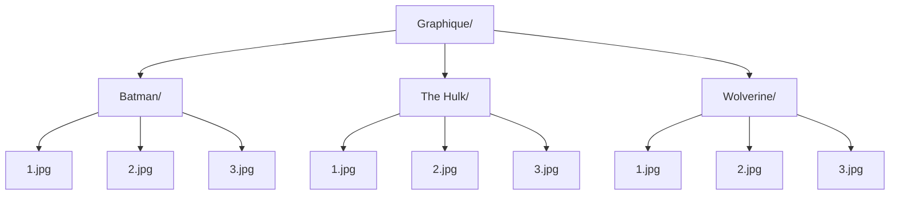

**Graphique: Comic Strip Reader**

**Instructions**
1. Create category folders e.g. Batman 
2. Add images based on categories 
3. Use all button to display all covers
4. Use search function to filter collection  

