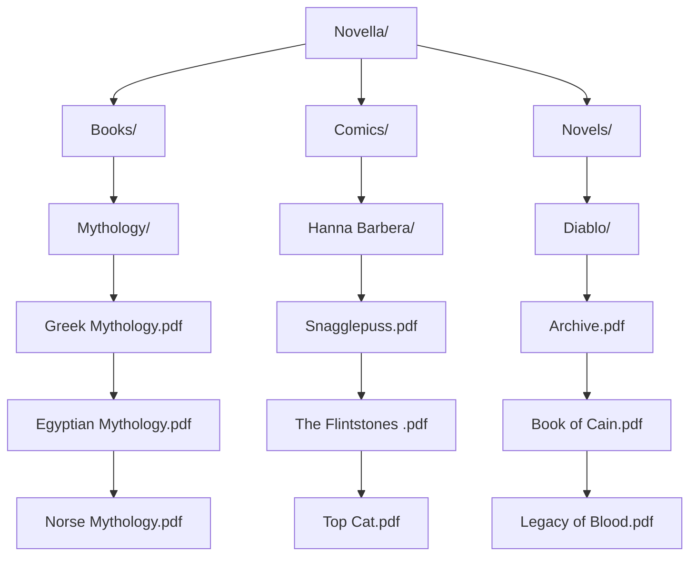

**Novella: Books, Comics and Novel Collection**

**Instructions**
1. Create category folders e.g. Books
2. Create subfolders based on categories e.g. Mythology 
3. Add ebooks (PDF files) in each category 

    

