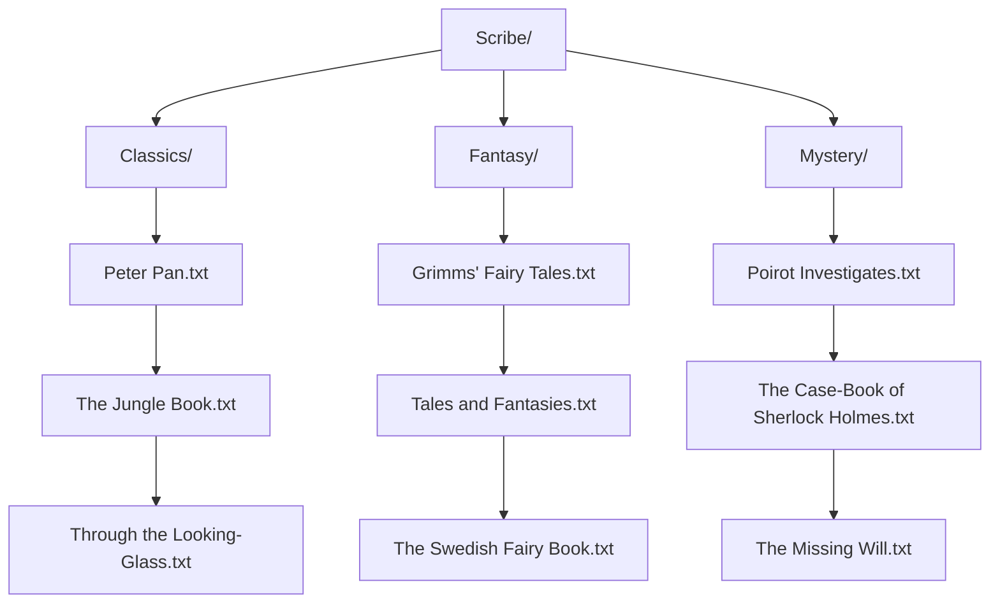

**Scribe: Text Book Collection**

**Instructions**
1. Create category folders e.g. Classics
2. Add text files (Books) in each category 

```mermaid
graph TD
    Scribe["Scribe/"] --> folder1["Classics/"]
    Scribe --> folder2["Fantasy/"]
    Scribe --> folder3["Mystery/"]

    folder1 --> txt1["Peter Pan.txt"]
    txt1 --> txt2["The Jungle Book.txt"]
    txt2 --> txt3["Through the Looking-Glass.txt"]

    folder2 --> txt4["Grimms' Fairy Tales.txt"]
    txt4 --> txt5["Tales and Fantasies.txt"]
    txt5 --> txt6["The Swedish Fairy Book.txt"]

    folder3 --> txt7["Poirot Investigates.txt"]
    txt7 --> txt8["The Case-Book of Sherlock Holmes.txt"]
    txt8 --> txt9["The Missing Will.txt"]

```