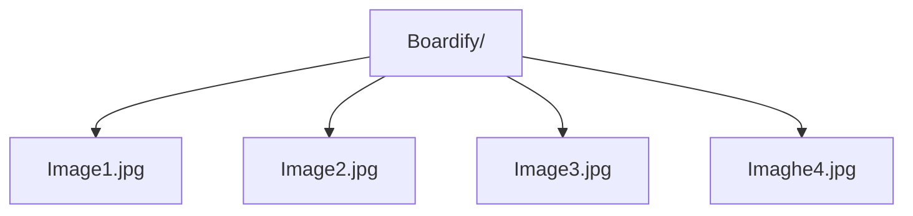

**Boardify: Image Viewer**

**Instructions**
1. Add images to Boardify folder
2. Use Load feature to retrieve images files
3. Use scan feature to display images from Boardify folder
4. Click on image to enlarge it
5. Supports all image formats 

 

