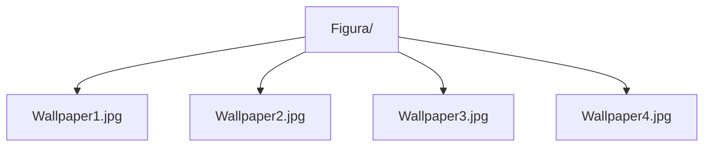

**Figura: Wallaper Viewer**

**Instructions**
1. Add images to Figura folder
2. Use Load feature to retrieve wallpapers
3. Use slidehsow feature to start it
4. Use previous and Next buttons to navigate through the wallpapers
5. Supports all image formats 

 

