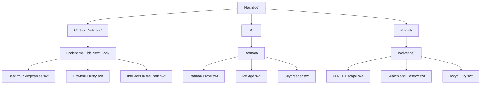

**Flashbot: Flash Game Collection**

**Instructions**
1. Create category folders e.g. Cartoon Network
2. Add subfolders based on category e.g Codename Kids Next Door
3. Add flash games based on category 
4. Search for category name 
5. Click on game to play 

 

