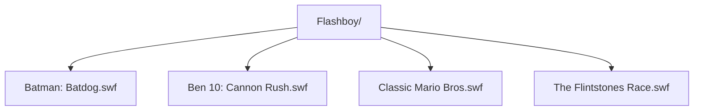

**Flashboy: Flash Game Player**

**Instructions**
1. Add flash games in Flashboy Folder
2. Use Load game feature to retrieve flash games
3. Use show games feature to display flash games from Flashboy folder
4. Select flash game via the playlist 
5. Search for game using search box

