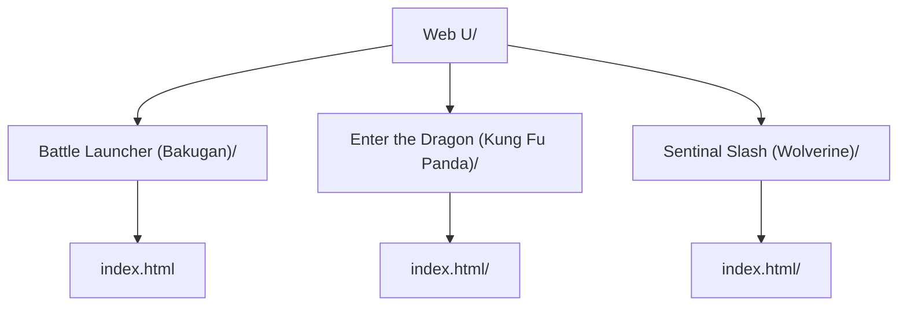

**Web U: HTML Game Player**

**Instructions**
1. Add HTML games in Web U Folder 
2. Use Load game feature to retrieve HTML games
3. Use show games feature to display HTML games from Flashboy folder
4. Select HTML game via the playlist 
5. Search for game using search box

