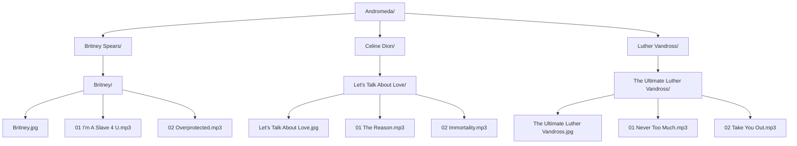

**Andromeda: Music Album and Playlist Player**

**Instructions**
1. Add albums to Andromeda folder
2. Use Load feature to retrieve albums
3. Use scan feature to display music from Andromeda folder
4. Click on album art to play album e.g Britney.jpg

 

