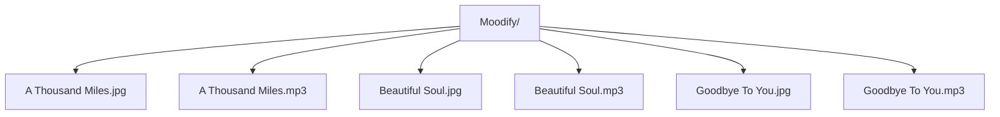

**Moodify: Music and Wallaper Player**

**Instructions**
1. Add music and wallpaper to Moodify folder
2. Use Load feature to retrieve music and wallpaper from folder
3. Use Scan feature to retrieve music and wallpaper from Moodify folder
4. Use Music controls 

 

