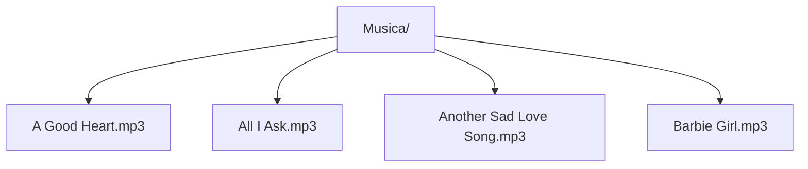

**Musica: Music Player**

**Instructions**
1. Add music in Musica Folder
2. Use Load feature to retrieve music
3. Use scan feature to display music from Musica folder
4. Use Music controls
5. Select music via the playlist 

 

