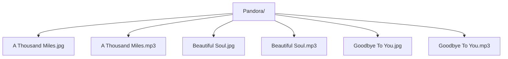

**Pandora: Music and Cover Art Player**

**Instructions**
1. Add music and cover art to Pandora folder
2. Use Load feature to retrieve music and cover art from folder
3. Use Scan feature to retrieve music and cover art from Pandora folder
4. Use Music controls 

 

