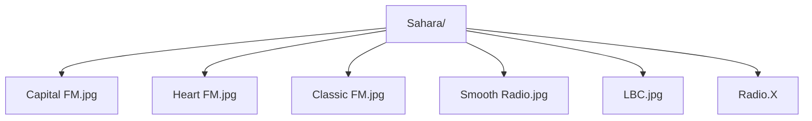

**Sahara: BBC Radio Player**

**Instructions**
1. Select radio station
2. Play and Pause station 
3. Enjoy

```mermaid
graph TD
    Sahara["Sahara/"] --> file1["Capital FM.jpg"]
    Sahara --> file2["Heart FM.jpg"]
    Sahara --> file3["Classic FM.jpg"]
    Sahara--> file4["Smooth Radio.jpg"]
    Sahara --> file5["LBC.jpg"]
    Sahara--> file6["Radio.X"]

```

 

