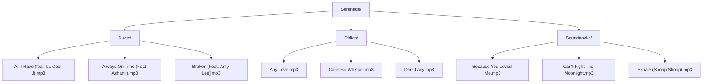

**Serenade: Music Genre Player**

**Instructions**
1. Create category folders e.g. Duets
2. Add audio to each category 
3. Use Music controls

```mermaid
graph TD
    Serenade["Serenade/"] --> folder1["Duets/"]
    Serenade --> folder2["Oldies/"]
    Serenade --> folder3["Soundtracks/"]
    
    folder1 --> pic1["All I Have (feat. LL Cool J).mp3"]
    folder1 --> audio1["Always On Time (Feat Ashanti).mp3"]
    folder1 --> pic2["Broken [Feat. Amy Lee].mp3"]

    folder2 --> pic3["Any Love.mp3"]
    folder2 --> audio3["Careless Whisper.mp3"]
    folder2 --> pic4["Dark Lady.mp3"]

    folder3 --> pic5["Because You Loved Me.mp3"]
    folder3 --> audio5["Can't Fight The Moonlight.mp3"]
    folder3 --> pic6["Exhale (Shoop Shoop).mp3"]


```

