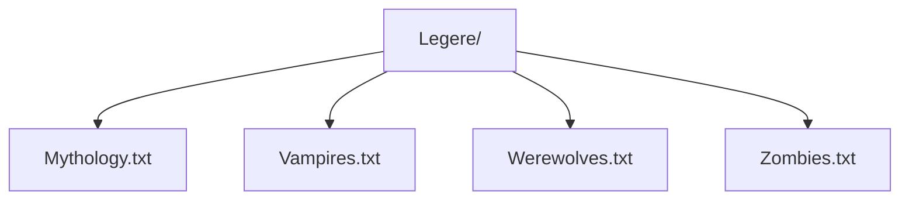

**Legere: Text Reader**

**Instructions**
1. Add music in Legere Folder
2. Use Load feature to retrieve text files
3. Use scan feature to display text files from Legere folder
5. Select text via the playlist 

 

