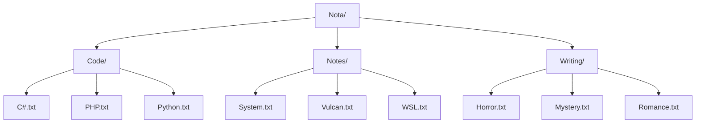

**Nota: Note Keeper**

**Instructions**
1. Create category folders e.g. Code
2. Add text files to each category 
3. Click on category to display text files
4. Select text file to view

```mermaid
graph TD
    Nota["Nota/"] --> folder1["Code/"]
    Nota --> folder2["Notes/"]
    Nota --> folder3["Writing/"]
    
    folder1 --> pic1["C#.txt"]
    folder1 --> audio1["PHP.txt"]
    folder1 --> pic2["Python.txt"]

    folder2 --> pic3["System.txt"]
    folder2 --> audio3["Vulcan.txt"]
    folder2 --> pic4["WSL.txt"]

    folder3 --> pic5["Horror.txt"]
    folder3 --> audio5["Mystery.txt"]
    folder3 --> pic6["Romance.txt"]


```
