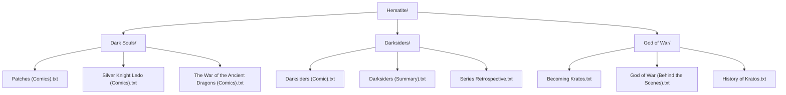

**Hematite: Online Video Text Player**

**Instructions**
1. Create category folders e,g Dark Souls
2. Add text files to each category 
3. Embed video code into text file
4. Search for text files

```mermaid
graph TD
    Hematite["Hematite/"] --> folder1["Dark Souls/"]
    Hematite --> folder2["Darksiders/"]
    Hematite --> folder3["God of War/"]
    
    folder1 --> text1["Patches (Comics).txt"]
    folder1 --> text2["Silver Knight Ledo (Comics).txt"]
    folder1 --> text3["The War of the Ancient Dragons (Comics).txt"]

    folder2 --> text4["Darksiders (Comic).txt"]
    folder2 --> text5["Darksiders (Summary).txt"]
    folder2 --> text6["Series Retrospective.txt"]

    folder3 --> text7["Becoming Kratos.txt"]
    folder3 --> text8["God of War (Behind the Scenes).txt"]
    folder3 --> text9["History of Kratos.txt"]


```
