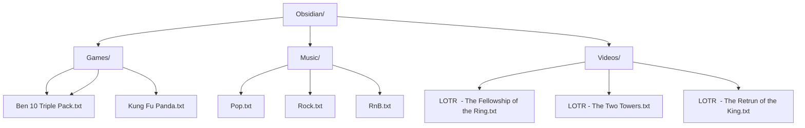

**Obsidian: Online Game, Music and Video Text Player**

**Instructions**
1. Create category folders e.g. Games
2. Add text files to each category 
3. Load and Scan text files
4. Reload function loads currect content 
5. Playlist displays category folders 

