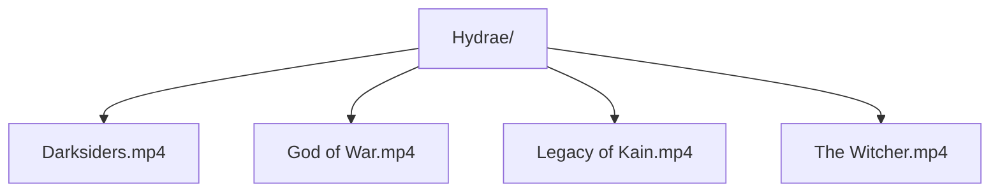

**Hydrae: Multi Video Player**

**Instructions**
1. Add videos to Hydrae folder. 
2. Use Load function to load videos 
3. Use Scan function to display videos

```mermaid
graph TD
    Hydrae["Hydrae/"] --> file1["Darksiders.mp4"]
    Hydrae --> file2["God of War.mp4"]
    Hydrae --> file3["Legacy of Kain.mp4"]
    Hydrae --> file4["The Witcher.mp4"]

```

