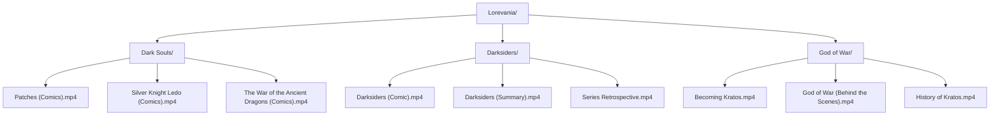

**Lorevania: Video Search Engine**

**Instructions**
1. Create category folders e.g. Dark Souls
3. Add videos in there respective folders
4. Type category folder in search box
 

```mermaid
graph TD
    Lorevania["Lorevania/"] --> folder1["Dark Souls/"]
    Lorevania --> folder2["Darksiders/"]
    Lorevania --> folder3["God of War/"]
    
    folder1 --> text1["Patches (Comics).mp4"]
    folder1 --> text2["Silver Knight Ledo (Comics).mp4"]
    folder1 --> text3["The War of the Ancient Dragons (Comics).mp4"]

    folder2 --> text4["Darksiders (Comic).mp4"]
    folder2 --> text5["Darksiders (Summary).mp4"]
    folder2 --> text6["Series Retrospective.mp4"]

    folder3 --> text7["Becoming Kratos.mp4"]
    folder3 --> text8["God of War (Behind the Scenes).mp4"]
    folder3 --> text9["History of Kratos.mp4"]


```

    

