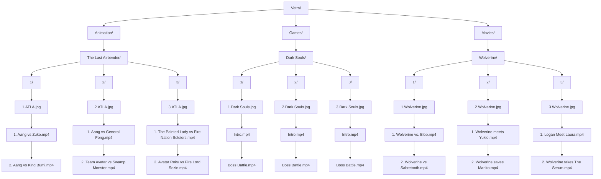

**Vetra: Video Collection**

**Instructions**
1. Create category folders e.g. Animation 
2. Add subfolders based on category e.g The Witcher
3. Add additional subfolders e.g 1,2,3
4. Add cover and wallaper in additional subfolders  
5. Ensure the cover is the first image in the subfolder e.g. 1. Wolverine or 0
6. Click on category or all button to display cover images 
7. Use search function to filter collection 

