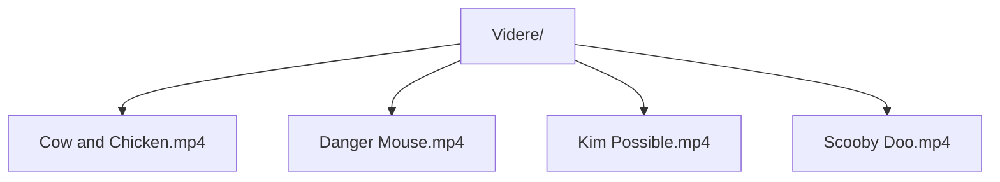

**Videre: Video Player**

**Instructions**
1. Add videos to Videre folder. 
2. Use Load function to load videos 
3. Use Scan function to display videos

```mermaid
graph TD
    Videre["Videre/"] --> file1["Cow and Chicken.mp4"]
    Videre --> file2["Danger Mouse.mp4"]
    Videre --> file3["Kim Possible.mp4"]
    Videre --> file4["Scooby Doo.mp4"]

```
