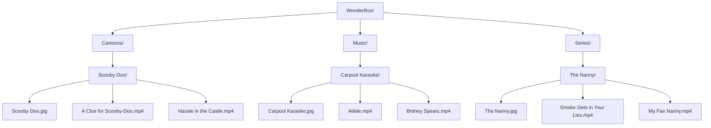

**WonderBox: Video Collection**

**Instructions**
1. Create category folders e.g. Cartoons
2. Add subfolders based on category e.g Scooby Doo
3. Add cover art and videos in respective folders 
4. Click on category to display cover art 
5. Use search function to filter collection 

